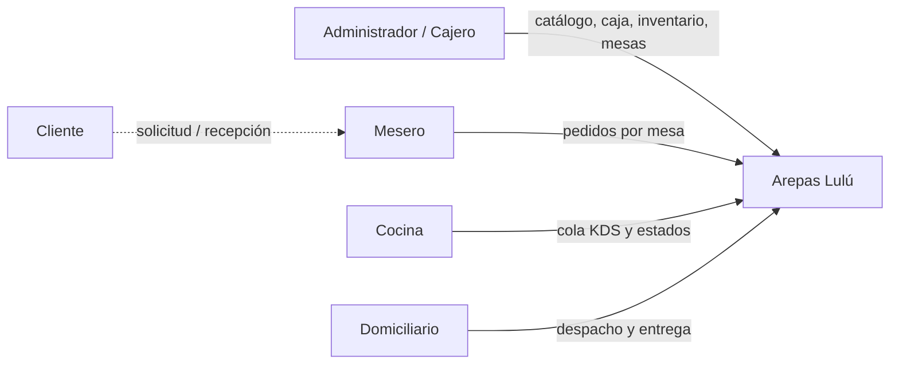
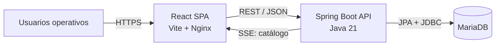
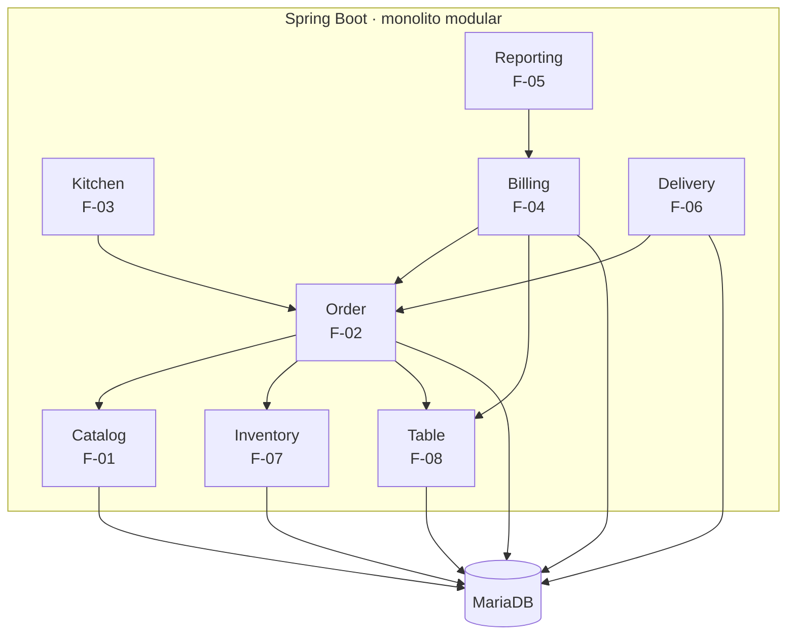

# Arquitectura C4 · Arepas Lulú

Este documento refleja la arquitectura implementada después de ampliar el prototipo a las ocho funcionalidades del Plan Vivo. C4 **documenta** la solución; el estilo implementado es una aplicación cliente-servidor de tres niveles con SPA React, API Spring Boot monolítica modular y MariaDB.

## Nivel 1 · Contexto

**Límite importante:** F-05 modela el estado de reporte DIAN como parte del prototipo académico. No existe conexión real con un servicio externo de la DIAN; por eso no se dibuja un sistema externo que daría una impresión falsa de integración.

## Nivel 2 · Contenedores

| Contenedor | Responsabilidad |
|---|---|
| React SPA | Interfaces F-01 a F-08, estado local de formularios/pedido y visualización operativa. |
| Spring Boot API | Reglas de negocio, coordinación de casos de uso, transacciones y contratos REST. |
| MariaDB | Productos, pedidos, pagos, facturas, clientes, domicilios, ingredientes, recetas y mesas. |

## Nivel 3 · Componentes de API

### Responsabilidad de cada componente

- **Catalog:** maestro de productos, precio, estado activo y disponibilidad; mantiene SSE existente.
- **Order:** agregado `Pedido + PedidoItem`, precio autoritativo, tipo `MESA/DOMICILIO` y persistencia.
- **Kitchen:** aplica el estado de la comanda mediante transiciones permitidas.
- **Billing:** valida orden cobrable, registra pago único, calcula cambio y genera factura.
- **Reporting:** agrega pagos/facturas por fecha y controla bandera de reporte DIAN.
- **Delivery:** clientes y seguimiento de entrega; reutiliza `Order` para crear el pedido de domicilio.
- **Inventory:** ingredientes, ajustes de stock y recetas; participa en la transacción de creación de pedido.
- **Table:** estado operativo/reservas; `Order` ocupa y `Billing` libera automáticamente.

## Patrones aplicados

- **Controller → Service → Repository** en todos los módulos.
- **JPA Repository** en catálogo/pedido y **Repository Gateway con JdbcTemplate** en operaciones nuevas.
- **Factory + Strategy** en construcción/precio de pedidos.
- **DTO / Mapper** para el contrato principal del pedido.
- **Reducer** en la construcción local del pedido de mesa.
- **Observer / Pub-Sub** por SSE en cambios de catálogo.
- **Dependency Injection** para conectar módulos sin `new` entre servicios.
- **Transacciones** para mantener consistencia pedido ↔ inventario ↔ mesa y pago ↔ factura ↔ mesa.

## Nivel 4 · Código

El nivel de código se evidencia en los paquetes bajo `backend/src/main/java/com/arepaslulu/` y en `frontend/src/modules/`. Cada carpeta corresponde a una capacidad del Plan Vivo y está referenciada en `docs/traceability/TRACEABILITY.md`.
