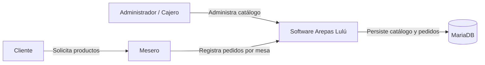
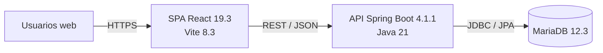
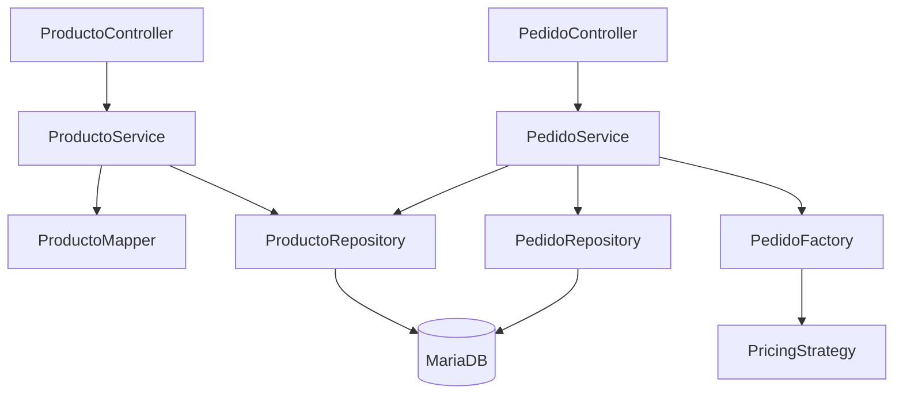

# Arquitectura C4 — Arepas Lulú

## C4 Nivel 1 — Contexto

### Sistema de interés

**Arepas Lulú** digitaliza el catálogo y el registro de pedidos, evitando dependencia de libreta/vale y conservando información trazable.

## C4 Nivel 2 — Contenedores

### Contenedores

1. **Web App React**: interfaz del administrador y mesero; conserva temporalmente el pedido en estado local y escucha eventos SSE del catálogo.
2. **API Spring Boot**: reglas de negocio, validación, casos de uso y transacciones.
3. **MariaDB**: persistencia relacional de productos, pedidos e ítems.

## C4 Nivel 3 — Componentes del API

### Responsabilidades

- `ProductoController`: contrato HTTP de F-01.
- `ProductoService`: reglas y transacciones del catálogo.
- `ProductoRepository`: acceso a productos.
- `PedidoController`: contrato HTTP de F-02.
- `PedidoService`: valida disponibilidad y coordina creación/consulta.
- `PedidoFactory`: crea el agregado `Pedido` de manera consistente.
- `PricingStrategy`: estrategia intercambiable para subtotal/precio.
- `PedidoRepository`: persistencia del agregado.

## Decisiones arquitectónicas

### ADR-001 — SPA + API REST

Se usa React separado de Spring Boot para que la interfaz web pueda evolucionar independientemente del backend.

### ADR-002 — Persistencia relacional

MariaDB mantiene relaciones entre pedido e ítems y ofrece integridad referencial. El precio se copia al ítem como **snapshot**, evitando que un cambio futuro del catálogo altere pedidos históricos.

### ADR-003 — Borrado lógico de productos

`DELETE /productos/{id}` cambia `activo=false`. Esto evita romper pedidos históricos asociados al producto.

### ADR-004 — Disponibilidad de F-01 vs inventario de F-07

F-01 usa un indicador de disponibilidad operativa del producto. El descuento de ingredientes/recetas y stock real se reserva para F-07.

### ADR-005 — El backend no confía en precios enviados por el cliente

F-02 recibe `productoId`, cantidad y observación. El backend toma el precio vigente del catálogo y calcula el total. Así se evita manipulación o inconsistencias de precio desde la SPA.

### ADR-006 — Sincronización del catálogo por SSE

Para satisfacer la actualización inmediata del catálogo sin introducir todavía la infraestructura WebSocket prevista para F-03/F-07, F-01 publica un evento `catalog-changed` mediante Server-Sent Events. Los clientes React conectados vuelven a consultar el catálogo al recibirlo.
